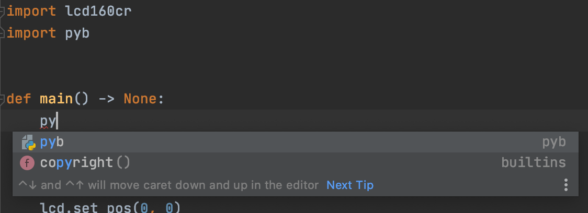
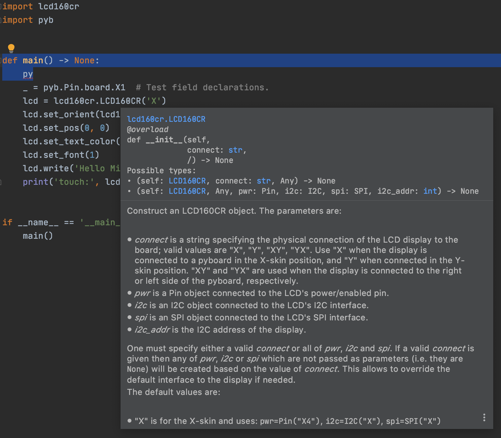
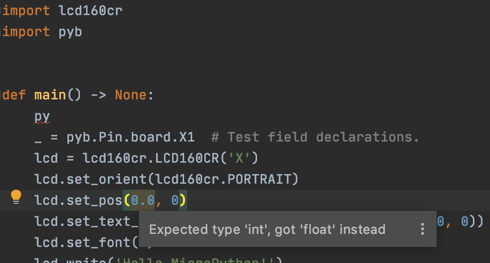
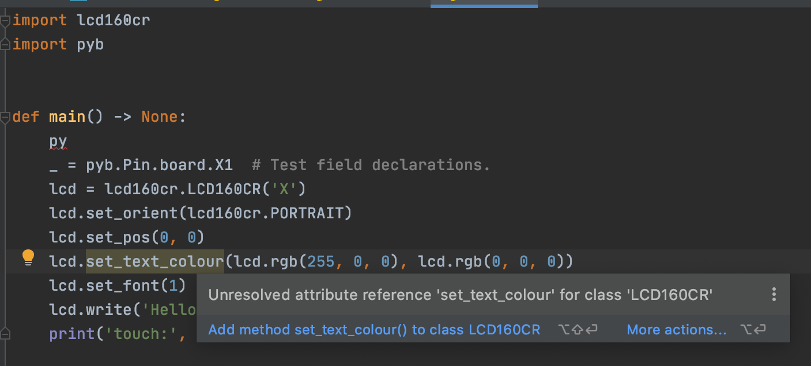
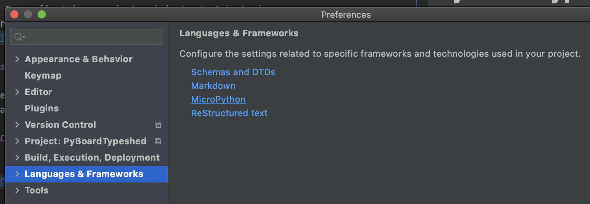
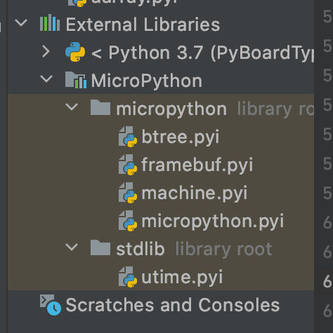
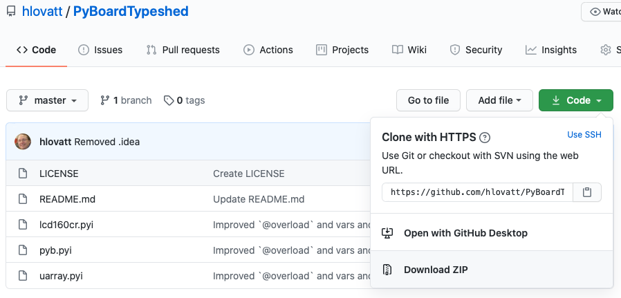
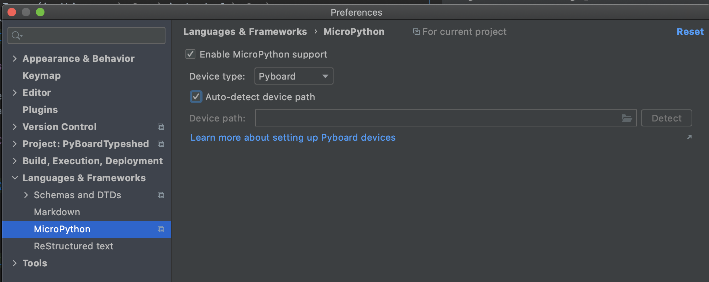
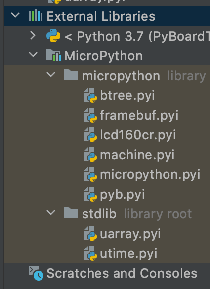

# PyBoardTypeshed

Typeshed (type hint interface stubs `.pyi`) for a 
[PyBoard](https://store.micropython.org/product/PYBv1.1), 
i.e. type hints and documentation for functions, classes, and constants
for [MicroPython](http://micropython.org).
These typesheds are useful for IDEs that understand type hints, 
like PyCharm and VSCode, and for IDE plugins like the PyCharm's 
MicroPython plugin.

## What the typesheds do

Once installed, see next section, the typesheds offer:

  1. Code completion (in this case prompting completion for `pyb`):\
  

  2. Rich help text (in this case constructor for `LCD160CR` showing 
  types and overloads as well as description):\
  
  
  3. Type errors (in this case a `float` instead of an `int`):\
  

  4. Typos (in this case `colour` instead of `color`; 
  error can be avoided by using code completion, see point 1 above):\
  

## Using the typesheds

There are three ways of installing the Typesheds: 
hopefully in the future via plugins, 
manually install in IDE, and copy the `.pyi` files into a project.

### Via an IDE plugin

#### For PyCharm

Currently, August 2020, have pull request in with PyCharm Micropython 
plugin to add these typesheds.
If JetBrains add these typesheds it will be the easiest solution and also
the typesheds will get updated everytime the plugin is updated.
The other options, below, unfortunately require manual updating
and are more involved (though not difficult).

### Manually install in IDE

#### For PyCharm

**Note:** The following procedure, below, 
only needs to be done for one project;
after which all projects using the MicroPython plugin 
will pick up the typesheds:

  1. Install the 
  [MicroPython plugin](https://plugins.jetbrains.com/plugin/9777-micropython)
  (also see section "Via an IDE plugin" above).
  
  2. Enable the plugin for the project 
  (two stages in project preferences/options:
  add the plugin to the project and then select options in the plugin):\
  
  ")
  
  3. The plugin contains some limited typesheds:\
  

  4. Download the ZIPed `.pyi` files from GitHub:\
  

  5. Unpack the ZIP file.
  
  6. Drag (or copy and past) the `.pyi` (only) files into the 
  Micropython Plugin 
  (`.pyi` files normally go into `Micropython -> micropython` but the files
  who's name begin with `u` go into `Micropython -> stdlib`):\
  

  7. Disable and re-enable plugin by 
  going to preferences/options un-tick Micropython support and Apply then 
  re-tick MicroPython support and OK
  (so that it picks up the changes):\
  
  
  8. Plugin now has typesheds from this repository and those provided 
  by the Micropython plugin:\
  

### Copy `.pyi` files into project

**Note:** The following procedure, below, needs to be done for *all* projects:

  1. Download the ZIPed `.pyi` files from GitHub:\
  

  2. Unpack the ZIP file.
  
  3. Drag the `.pyi` (only) files into the top level of a project:\
  

## Philosophy

The typesheds are generated by 
[https://github.com/hlovatt/PyBoardTypeshedGenerator]()
from the MicroPython `.rst` doc files.

The philosophy of generating the typesheds is to take a superset of what is 
in the docs and what is listed by the `dir` command on a PyBoard
(the docs and `dir` don't agree!). 
An example of the `dir` command having more information than the docs is
the docs for `pyb.Pin` mentions `board` and `cpu` classes 
and implies they contain declarations of available `Pin`s;
`dir(pyb.Pin.cpu)` on the other hand lists the `Pin`s, 
therefore the generated typeshed contains `board` and `cpu` *with* `Pin` 
definitions.

**Note:** In the descriptions above, PyBoard means 
[PyBoard V1.1](https://store.micropython.org/product/PYBv1.1), 
not any other PyBoard. 
Though the other PyBoards are 
similar and therefore the typesheds are still useful.
